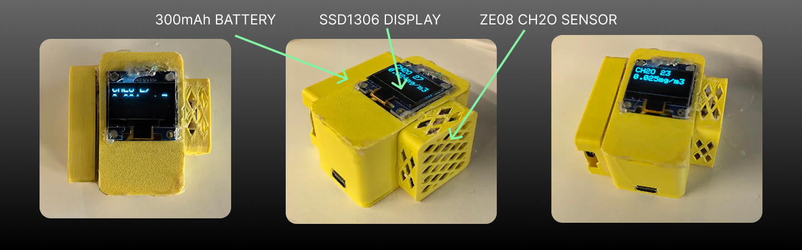

# ESP32 Sensor Display

Breathe safer with our smart air quality monitor.
Powered by ESP32, it tracks formaldehyde (CH₂O) in real time with professional-grade precision, showing results instantly on a crisp OLED display. Designed with ultra-low power mode and one-button sleep/wake control, it’s efficient, portable, and always ready. With Wi-Fi connectivity, your data can be synced to the cloud for smarter insights—making clean air monitoring simple and reliable.




This project is an ESP32-based smart air quality monitor designed to measure formaldehyde (CH₂O) concentration using the ZE08-CH2O gas sensor. The system processes sensor data via UART, calculates the gas concentration in mg/m³, and displays the results in real time on a low-power OLED screen (SSD1306). It also features power management with a BOOT button that toggles deep sleep mode, preserving state across reboots using RTC memory. Wi-Fi functionality is included (currently optional) to upload sensor readings as JSON data to a remote server for cloud integration. By combining local visualization, energy efficiency, and IoT connectivity, this device provides a compact and practical solution for indoor air quality monitoring.


## Build

```
curl -fsSL https://raw.githubusercontent.com/arduino/arduino-cli/master/install.sh | sh
export PATH=~/Arduino/bin:$PATH
```

```
./scripts/build_base.sh esp32 ttyUSB0 SensorDisplay
```


## ESP HOME

https://esphome.io/components/api


```
pip3 install esphome
mkdir ~/esphome
cd ~/esphome

esphome wizard livingroom_sensor.yaml
esphome run livingroom_sensor.yaml
```

```
esphome dashboard ~/esphome
```
